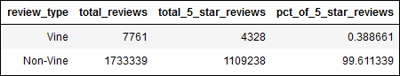
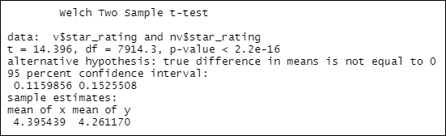
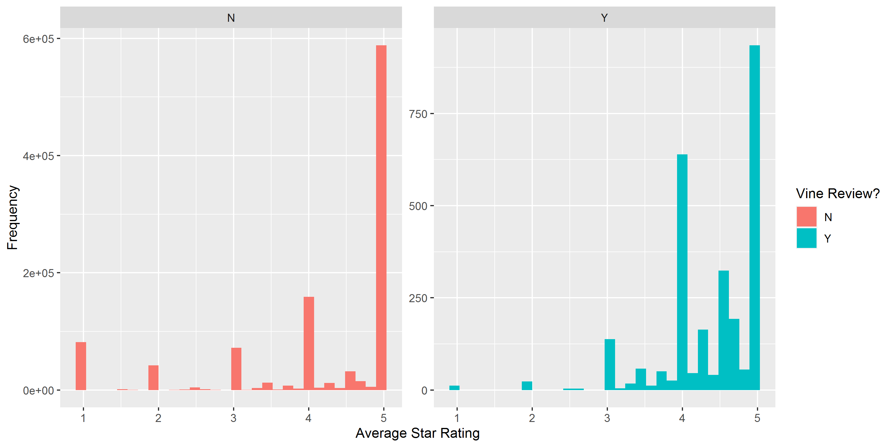

# Module 16 Challenge - Amazon Vine Analysis - AWS and PySpark

## Overview

### Purpose

The purpose of this analysis is to analyze Amazon reviews written by members
of the paid Amazon Vine Program.

For this analysis, the `us_Tools_v1_00` Dataset will be used.

### Tasks

1. Choose a dataset from the collection of Amazon Example Product Reviews
	- For purposes of this analysis, the `us_Tools_v1_00` Dataset will be used.
2. Use PySpark to perform the ETL process to extract the dataset, transform the data,
connect to an AWS RDS instance, and load the transformed data into a PostgreSQL Database
3. Use PySpark, Pandas, or SQL to determine if there is any bias toward favorable reviews
from Vine members in the selected dataset.
4. Write a summary of the analysis (this README.md)

### Approach

1. Create a PostgreSQL Database Hosted on Amazon AWS.
2. Connect to this database via pgAdmin.
3. Within pgAdmin, create tables using client-provided pre-defined schema.
4. Import provided Starter Code to Google Colab Notebook.
5. Extract one of the review datasets, and create a new DataFrame containing the data.
6. Transform the dataset into four DataFrames that will match the schema in the pgAdmin tables.
7. Determine bias of Vine Reviews

## Deliverables

### Deliverable 1

See `Amazon_Reviews_ETL.ipynb`

### Deliverable 2

See `Vine_Review_Analysis.ipynb`

## Results

The summary table of analysis from Deliverable 2, Instruction #5, in `Vine_Review_Analysis.ipynb` is shown here as Figure 1 for
reference while considering the questions below.

**Figure 1: Vine Review Analysis Results**

- Q: How many Vine reviews and non-Vine reviews were there?
    - A:
		- Vine Reviews: 7,761
		- Non-Vine Reviews: 1,733,339

- Q: How many Vine reviews were 5 stars? How many non-Vine reviews were 5 stars?
    - A:
		- Vine Reviews: 4,328
		- Non-Vine Reviews: 1,109,238

- Q: What percentage of Vine reviews were 5 stars? What percentage of non-Vine reviews were 5 stars?
    - A:
		- Vine Reviews: 0.3887%
		- Non-Vine Reviews: 99.6113%

## Summary

### Is there any positivity bias for reviews in the Vine Program?

Based solely on the analysis above, it would be very difficult to tell. Using a more robust statistical methodology, such as the 
Welch Two Sample t-test, we can compare the Means of all the Star Ratings between the Vine Reviews and Non-Vine Reviews.

Using this test, we can determine that the Mean Star Rating for Vine Reviews is 4.395, and the Mean Star Rating for the Non-Vine Reviews
is 4.261. The p-value obtained from this test was 2.2e-16, meaning that we Reject the Null Hypothesis that the Means are Statistically
Similar, and conclude that they are NOT statistically similar.

The results of this test as performed in R/RStudio are reproduced below in Figure 2.

**Figure 2: Welch Two Sample t-test Results for Vine and Non-Vine Reviews**

Since the Mean Star Rating for Vine Reviews is *higher* than the
Mean Star Rating for Non-Vine Reviews, we can conclude that:

**YES**, there is a positivity bias for reviews in the Vine Program.

Another way to check this interpretation is to visually compare a pair of histograms
for the distribution of Average Star Ratings between Vine and Non-Vine Reviews.

These histograms are shown here in Figure 3.

**Figure 3: Pair of Histograms showing Distribution of Average Star Ratings between Vine and Non-Vine Reviews**

Comparing these two sets, we can see that among the Vine Reviews, 1-Star Reviews occur less frequently than
other-Starred Reviews do as compared to how they appear in the Non-Vine Reviews. Also there is a bias
towards reviews in the range of 4-5 Stars as compared to how they appear in the Non-Vine Reviews.

### What additional analysis could be performed to support these conclusions?

An additional analysis that could be performed to support these conclusions would be to compare the Mean of Star Ratings across different
sub-groups of reviewers, and not just all the Reviews at once.

Group 1: All Reviews 
Group 2: Reviews from Customers who *only* submitted Non-Vine Reviews 
Group 3: Reviews from Customers who submitted *both* Vine and Non-Vine Reviews 
Group 4: Reviews from Customers who submitted *only* Vine Reviews

This analysis was performed via a series of summary operations in R/RStudio, and the results are produced here in Table 3.

**Table 3: Summary of Average Star Rating Among Different Groups of Customers**
| Group           | n Customers     | Average star_rating [All Reviews] | Average star_rating [Non-Vine Reviews Only] | Average star_rating [Vine Reviews Only]
|:---------------:|----------------:|:---------------------------------:|:-------------------------------------------:|:--------------------------------------:
| 1               | 1,053,515       | 4.262 (n Reviews=1,741,100)       | 4.261 (n Reviews=1,733,339)                 | 4.395 (n Reviews=7,761)
| 2               | 1,050,766       | 4.186 (n Reviews=1,725,140)       |                                             |
| 3               |     1,245       | 4.386 (n Reviews=12,653)          | 4.391 (n Reviews=8,199)                     | 4.376 (n Reviews=4,454)
| 4               |     1,504       | 4.394 (n Reviews=3,307)           |                                             |

The results shown in in Table 3 demonstrate that overall, Vine Reviews have a higher Average Star Rating than Non-Vine Reviews, to a statistically
significant degree as discussed previously. Furthermore, among customers who submitted both reviews for the Vine Program and not as part of the Vine Program,
the Vine Reviews from those customers were higher on average than the reviews they had submitted outside the program.

If the difference in Average Star Rating for each customer in this group for their Vine Reviews and Non-Vine Reviews is taken, and then an average of all those
difference values is calculated, the result is 0.0368, a positive number. This means that more often than not, the difference between Vine and Non-Vine
Reviews is a positive difference, on average an increase of 0.0368 Stars per customer between Non-Vine and Vine Reviews.

Performing the analysis in this manner reduces the effect of searching for a Positivity Bias across the whole data set in aggregate, and instead asks the more targeted question:
Is there Positivity Bias for each customer who participates in the Vine Program?

Here again, we can conclude that:

**YES**, on average, there is positivity bias for reviews submitted by customers participating in the Vine Program.

-- END --
